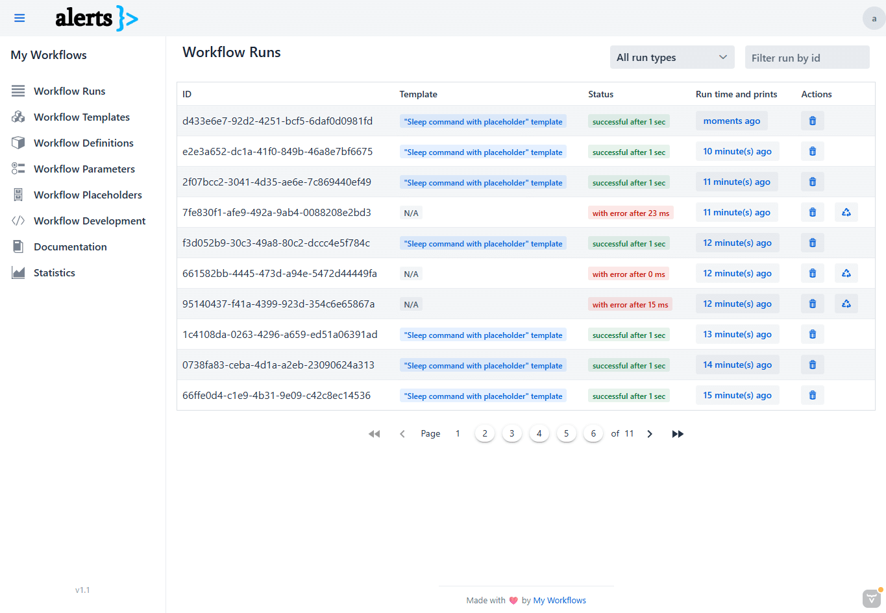
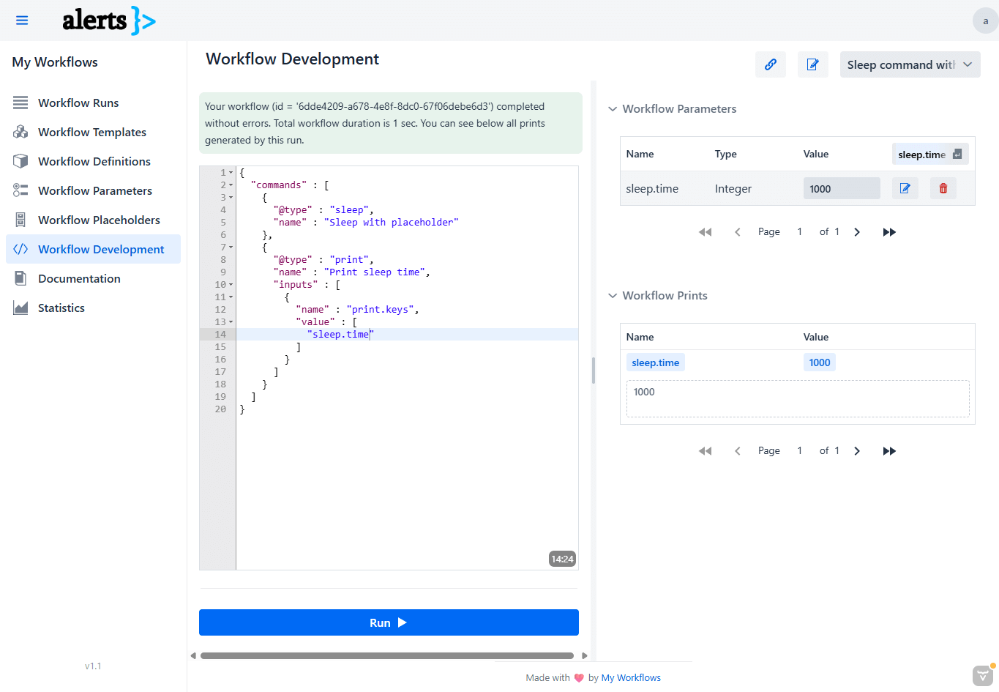
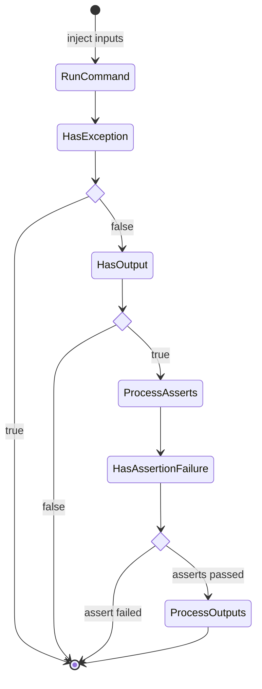

# MyWorkflows

[MyWorkflows](https://myworkflows.org) is a simple tool designed to help you automate manual tasks.
It allows you to encapsulate manual tasks as workflows, schedule them, and view their outputs.

The tool uses Java as its programming language and Vaadin as its UI framework.

MyWorkflows is ideal for small teams overwhelmed by daily manual tasks.
All workflows are defined in JSON format, and the tool provides an intuitive UI for interacting with them.

## Technology stack

* Java 21 as a programming language.
* Spring Boot 3.x as a DI framework.
* [Vaadin 24](https://vaadin.com) as a UI framework.
* [SQLite](https://www.sqlite.org/) as relational database for persisting data.
* [JSON Schema Validator](https://github.com/networknt/json-schema-validator) as JSON schema validator for workflow
  scripts.
* [Groovy](https://groovy-lang.org/) as an additional language for defining commands.
* [Janino](https://www.janino.net/) as Java runtime compiler.
* [SpEL](https://docs.spring.io/spring-framework/docs/3.0.x/reference/expressions.html) as another runtime evaluator.

## Features

* **Modern and responsive UI** for an enhanced user experience.
* **Authentication** and **authorization** enabled by default for secure access.
* **Vaadin Push** enabled—using WebSockets, the server can send real-time updates to the client.
* **Persistence layer** powered by **SQLite** for reliable data storage.
* Dedicated page for **workflow definition script development**, allowing you to:
    * Code your script.
    * Inject parameters.
    * Run the script and view its output.
    * Benefit from an editor with auto-complete functionality to simplify your workflow scripting.
    * Share the script made together with the params
* Dedicated web pages for managing **workflow placeholders**, **workflow definitions**, **workflow templates**, and *
  *workflow runs**.
* A dedicated web page for managing **Java libraries** at runtime.
* A dedicated web page for writing **markdown documentation** with ease.
* A dedicated web page for viewing and analyzing **statistics**.

## TODOs

- [ ] **Checkpoints**. Introduce the ability to reschedule a failing workflow from a specific moment in time.
- [ ] **Debug mode**. Improve debugging experience for failing workflows to easily find the root cause of their failure.

## In action

### Workflow Runs View



### Workflow Development View



## How does it work?

### Abbreviations

* **Workflow**: Represents a list of steps to resolve a given task.
* **Command**: Represents a unitary step in the workflow. A command has a `name`, a `@type`, `ifs`, `inputs`,
  `asserts` and `outputs`. `name` and `@type` are mandatory for being able to define a valid command.
* **If**: Each command allows defining some running conditions. If at least one condition is not met, the command will
  be skipped.
* **Input**: Each command allows input parameters to customize the running step.
* **Assert**: Once a command is run, if the command output exists, you can inject different assertions.
* **Output**: Once a command is run, if the command output exists, you can do other processing (like saving the output
  in another variable)
* **Variable**: Represents a standalone data variable which is generated by a command and can be used as input by
  upcoming commands.

### Workflow

`Workflow` is the logic entity that encapsulates multiple steps - called `commands` - needed to implement a task.
Each workflow has a `name` to be able to identify easily what is doing.

When the time comes, the workflow can be run `manually` by the user or `automatically` using a scheduler.
Behind the scene, there is a `thread pool` responsible for executing the workflow.
Each workflow is scheduled to run inside a single thread, and all his commands are run in sequential order.

#### Command

Each command has:

* a `@type`
* `inputs` - defines the customization for current run
* an `output` - defines the output returned
* `asserts` - to assert different things when the output is present
* `outputs` - to process output even more and to save partial outputs in other variables

The following state diagram describes how a command works:



### Features

#### `Finally` commands

The concept of `finally commands` lets you declare some special commands for your workflow to be executed at the end, no
matter if the workflow failed or not.
The concept is similar with `try-finally` block functionality from Java.

```
try { 
  // Run all commands in a sequential order
} finally {
  // Run all finallyCommands in a sequential order
}
```

> [!TIP]
> You are not allowed to have more than 10 finally commands inside one workflow definition!

#### Placeholders

You are allowed to use global `placeholders` to avoid data duplication in your workflow definition.
Please note that all placeholders are resolved immediately before a workflow running process.
All placeholders are persisted in a database—a table called `placeholders`.

Inside workflow definition, you can recognize a placeholder by having this format: `$$([A-Z0-9_.]+)`.
You are allowed to use placeholders inside any `input`, `assert` and `output` (`name` and `value` fields).

> [!TIP]
> The name of the placeholder should match pattern `[A-Z0-9_.]+` for being accepted as a valid placeholder.

> [!TIP]
> If the placeholder that you are looking for is not found, you are going to receive a runtime exception.

#### Expressions

Expressions are the heart of this tool.
By using them, you will be able to pass information between commands.
Expressions are evaluated at runtime, and they can be used anywhere inside an `input`, `assert`, `output` or `if`
structure.
Inside this structure, the expression will always be encapsulated inside `value` field.
Each expression is evaluated by a runtime evaluator specified by the user, after filling `@type` field.

For the moment, there are **3 runtime evaluators** supported:

1. Set `@type` to `groovy` if you want to enable Groovy runtime evaluator.
2. Set `@type` to `java` if you want to enable Java runtime evaluator based on [Janino](https://www.janino.net/) runtime
   compiler.
3. Set `@type` to `spel` if you want to
   enable [SpEL](https://docs.spring.io/spring-framework/docs/3.0.x/reference/expressions.html) runtime evaluator.

If `@type` is not set, the default value for this field will be set to `plain` which means the value will be treated
as it is.

##### Examples

###### Retrieve exit code after running `sshExec` command by using SpEL runtime evaluator

```json
{
  "name": "Asserts output exitCode to be equal with 0",
  "@type": "spel",
  "value": "#output.getExitCode() == 0"
}
```

###### Retrieve information from workflow run cache and save it to another variable (named `sleep.time`)

```json
{
  "name": "sleep.time",
  "@type": "groovy",
  "value": "cache.get('sleepTime').toInteger()"
}
```

##### Cache access patterns

If you analyze all the above examples, you are going to see that sometimes it is quite challenging to write the
expression because it is too long.
In addition, by accessing the workflow run cache using the following pattern `cache.get('sleepTime')`, it makes the
expression harder to be read.

This is why you can use a simplified version by using **the cache access pattern feature** exposed by this tool.

If we take one of the previous examples:

```json
{
  "name": "sleep.time",
  "@type": "groovy",
  "value": "cache.get('sleepTime').toInteger()"
}
```

we can rewrite it like this:

```json
{
  "name": "sleep.time",
  "@type": "groovy",
  "value": "$(sleepTime:Integer.class)"
}
```

The tool will be able to recognize every string pattern inside `value` which matches the following regex pattern:
`\$\(([a-zA-Z0-9_.]+)(:[a-zA-Z0-9_.]+)?\)`.
The string between parenthesis is split in two parts: the first part defines the name of the variable that we are going
to
search into workflow run cache (this part is mandatory) and the second part (which is optional) and defines a type of
the value that we are looking for.

If there is no variable named `sleepTime` of type `Integer` in the workflow run cache, during workflow execution phase,
you are going to receive a runtime exception.

#### Load Java libraries at runtime

The tool is capable of loading a list of Java libraries (JAR files) at runtime, during the application initialization
phase.
This is quite useful if you want to extend `java` or `groovy` commands with more functionalities.

To do this, please use the following application config property:

```yaml
my-workflows:
  config:
    library:
      base-directory: "./libs" # Directory where all JAR files will be discovered
      reload-after-upload: false # Set this property on true to reload at runtime the new libraries after uploading them
```

#### Comments

From a technical point of view, each workflow is defined in JSON format.
If you are familiar with JSON, you probably know that comments are not allowed.
Since comments are useful sometimes, there is a hack that can be implemented to have this wonderful feature: by using a
dedicated field called `_comment.*`.
This field can be used anywhere in the workflow definition.

#### Shortcuts

Shortcuts are present for multiple views, and they are here to improve your experience.

* **Workflow Development** view:
    * <kbd>Ctrl</kbd> + <kbd>Alt</kbd> + <kbd>R</kbd> = runs the workflow
    * <kbd>Ctrl</kbd> + <kbd>Alt</kbd> + <kbd>U</kbd> = updates the workflow
    * <kbd>Ctrl</kbd> + <kbd>Alt</kbd> + <kbd>S</kbd> = shares the workflow
    * <kbd>Ctrl</kbd> + <kbd>Alt</kbd> + <kbd>F</kbd> = reformats the code present inside the editor. Needs editor
      focus.
    * <kbd>Ctrl</kbd> + <kbd>Alt</kbd> + <kbd>W</kbd> = wraps / unwraps the code present inside the editor. Needs editor
      focus.

#### REST API interface

The app provides also a REST API interface that can be used to interact with the app in a programmatic mode.

By default, the REST API is not enabled by default, but you can enable this feature by setting the following
application config `my-workflows.config.feature.restApiEnabled` on `true`.

Each user has a `token` field (usually 64 random characters) which represents the API token that can be used to
authenticate REST API calls. The token is unique across all users, so we cannot have two users with the same token.

To authenticate all REST API calls, you need to fill URL parameter `token` for each request performed:
`GET:https://myworkflows.org/workflow-definitions?token={TOKEN}`.

The following APIs are available for you:

##### `WorkflowDefinition` APIs

| Method | URI                                              | Description                                                                                                                                                                                                                                                      |
|--------|--------------------------------------------------|------------------------------------------------------------------------------------------------------------------------------------------------------------------------------------------------------------------------------------------------------------------|
| `GET`  | `/api/v1/workflow-definitions`                   | Returns all workflow definitions as a list of `WorkflowDefinitionResponse` objects.                                                                                                                                                                              |
| `GET`  | `/api/v1/workflow-definitions/{id}`              | Returns a single workflow definition (selected after `id` where type is `int`) as `WorkflowDefinitionResponse` object. An exception is raised if nothing is found.                                                                                               |
| `POST` | `/api/v1/workflow-definitions/{id}/schedule-now` | Schedules immediately a run for a specific workflow definition (selected after `id` where type is `int`). Request body is mandatory and contains an object of `Map<String, Object>` with parameters. It returns the UUID as string to identify the workflow run. |

##### `WorkflowTemplate` APIs

| Method | URI                                            | Description                                                                                                                                                    |
|--------|------------------------------------------------|----------------------------------------------------------------------------------------------------------------------------------------------------------------|
| `GET`  | `/api/v1/workflow-templates`                   | Returns all workflow templates as a list of `WorkflowTemplateResponse` objects.                                                                                |
| `GET`  | `/api/v1/workflow-templates/{id}`              | Returns a single workflow template (selected after `id` where type is `int`) as `WorkflowTemplateResponse` object. An exception is raised if nothing is found. |
| `POST` | `/api/v1/workflow-templates/{id}/schedule-now` | Schedules immediately a run for a specific workflow template (selected after `id` where type is `int`). Nothing is returned.                                   |

##### `WorkflowRun` APIs

| Method | URI                          | Description                                                                                                                                             |
|--------|------------------------------|---------------------------------------------------------------------------------------------------------------------------------------------------------|
| `GET`  | `/api/v1/workflow-runs`      | Returns all workflow runs as a list of `WorkflowRunResponse` objects.                                                                                   |
| `GET`  | `/api/v1/workflow-runs/{id}` | Returns a single workflow run (selected after `id` where type is `String`) as `WorkflowRunResponse` object. An exception is raised if nothing is found. |

## Predefined type of commands

### Database command

Provides an ability to interact with a relational database by running SQL queries.

| `@type`    | Inputs                                                                                                                                                                                      | Output                         |
|------------|---------------------------------------------------------------------------------------------------------------------------------------------------------------------------------------------|--------------------------------|
| `database` | <ul><li><strong>database.url</strong>: Mandatory. Represents the connection URL.</li><li><strong>database.query</strong>: Mandatory. Represents the query which will be executed.</li></ul> | Returns `Optional<ResultSet>`. |

Example of a fake command:

```json
{
  "name": "Run SELECT query",
  "@type": "database",
  "inputs": [
    {
      "name": "database.url",
      "value": "jdbc:sqlite:database.db"
    },
    {
      "name": "database.query",
      "value": "SELECT * FROM test"
    }
  ]
}
```

### Email command

This command allows sending emails using Jakarta Mail API.

| `@type` | Inputs                                                                                                                                                                                                                                                                                                                                                                                                                                                                                                                                                                                                                                                                                            | Output |
|---------|---------------------------------------------------------------------------------------------------------------------------------------------------------------------------------------------------------------------------------------------------------------------------------------------------------------------------------------------------------------------------------------------------------------------------------------------------------------------------------------------------------------------------------------------------------------------------------------------------------------------------------------------------------------------------------------------------|--------|
| `email` | <ul><li><strong>email.from</strong>: Mandatory. Email address for the sender.</li><li><strong>email.to</strong>: Mandatory. Email address for the receiver.</li><li><strong>email.subject</strong>: Mandatory. The email subject.</li><li><strong>email.body</strong>: Mandatory. The email body.</li><li><strong>email.props</strong>: Mandatory. Email properties as map.</li><li><em>email.bodyType</em>: Optional. Defines the type of the body. Default value: `text/html; charset=utf-8`.</li><li><em>email.username</em>: Optional. The user name for authentication. Keep it blank to disable authentication.</li><li><em>email.password</em>: Optional. Password for the user.</li></ul> | N/A    |

Example of a fake command:

```json
{
  "name": "Send an email",
  "@type": "email",
  "inputs": [
    {
      "name": "email.from",
      "value": "from@gmail.com"
    },
    {
      "name": "email.to",
      "value": "to@gmail.com"
    },
    {
      "name": "email.subject",
      "value": "Simple subject"
    },
    {
      "name": "email.body",
      "value": "Simple <strong>body</strong>"
    },
    {
      "name": "email.props",
      "value": {
        "mail.smtp.auth": true,
        "mail.smtp.starttls.enable": "true",
        "mail.smtp.host": "sandbox.smtp.mailtrap.ip",
        "mail.smtp.port": "25",
        "mail.smtp.ssl.trust": "sandbox.smtp.mailtrap.io"
      }
    },
    {
      "name": "email.username",
      "value": "user"
    },
    {
      "name": "email.password",
      "value": "pass"
    }
  ]
}
```

### Groovy command

Provides an ability to run Groovy code at runtime.
As you probably already imagine, this command is very powerful.

| `@type`  | Inputs                                                                                                                                                                                                                                                                        | Output                             |
|----------|-------------------------------------------------------------------------------------------------------------------------------------------------------------------------------------------------------------------------------------------------------------------------------|------------------------------------|
| `groovy` | <ul><li><strong>groovy.scriptLines</strong>: Mandatory. Represents source code which contains definition of a `groovy.method` (or `run`) method to be executed.</li><li><em>groovy.method</em>: Optional. Represents the method name invoked when code is executed.</li></ul> | Return of invoked method or `void` |

Example of a fake command:

```json
{
  "name": "Run empty method",
  "@type": "groovy",
  "inputs": [
    {
      "name": "groovy.scriptLines",
      "value": [
        "def run(workflowRunCache) {",
        "}"
      ]
    },
    {
      "name": "groovy.method",
      "value": "run"
    }
  ]
}
```

### HTTP Request command

This command provides a programmatic way to do HTTP requests.

| `@type`       | Inputs                                                                                                                                                                                                                                                                                                                                                                                                                                                                                        | Output                   |
|---------------|-----------------------------------------------------------------------------------------------------------------------------------------------------------------------------------------------------------------------------------------------------------------------------------------------------------------------------------------------------------------------------------------------------------------------------------------------------------------------------------------------|--------------------------|
| `httpRequest` | <ul><li><strong>httpRequest.url</strong>: Mandatory. Represents request URL.</li><li><em>httpRequest.method</em>: Optional. Represents request method type. Default value: `GET`.</li><li><em>httpRequest.body</em>: Optional. Represents request body. No body is set by default.</li><li><em>httpRequest.headers</em>: Optional. Map with request headers.</li><li><em>httpRequest.timeout</em>: Optional. Defines connection and read timeout in millis. Default value: `60000`.</li></ul> | `ResponseEntity<String>` |

Example of a fake command:

```json
{
  "name": "Simple GET HTTP request",
  "@type": "httpRequest",
  "inputs": [
    {
      "name": "httpRequest.url",
      "value": "https://myworkflows.org"
    }
  ]
}
```

### Java command

Provides an ability to run Java code at runtime.
Like for Groovy command, this command is also very powerful.

| `@type` | Inputs                                                                                                                                                                                                                                                                                                                                                                                                                                                                                                                                                                                                                                                                | Output                             |
|---------|-----------------------------------------------------------------------------------------------------------------------------------------------------------------------------------------------------------------------------------------------------------------------------------------------------------------------------------------------------------------------------------------------------------------------------------------------------------------------------------------------------------------------------------------------------------------------------------------------------------------------------------------------------------------------|------------------------------------|
| `java`  | <ul><li><strong>java.scriptLines</strong>: Mandatory. Represents source code which contains definition of a `java.method` (or `run`) method inside a class `java.clazz` (or `DynamicClass`) which will be executed.</li><li><em>java.method</em>: Optional. Represents the method name invoked when code is executed.</li><li><em>java.clazz</em>: Optional. Represents the class name invoked when code is executed.</li><li><em>java.sourceVersion</em>: Optional. Before running the script, set source version for Java compilation.</li><li><em>java.targetVersion</em>: Optional. Before running the script, set target version for Java compilation.</li></ul> | Return of invoked method or `void` |

Example of a fake command:

```json
{
  "name": "Run method which returns 0",
  "@type": "java",
  "inputs": [
    {
      "name": "java.scriptLines",
      "value": [
        "import org.myworkflows.domain.WorkflowRunCache;",
        "public class DynamicClass {",
        "  public int run(WorkflowRunCache cache) {",
        "    return 0;",
        "  }",
        "}"
      ]
    },
    {
      "name": "java.method",
      "value": "run"
    },
    {
      "name": "java.clazz",
      "value": "DynamicClass"
    }
  ]
}
```

### Loop command

This command lets you iterate over a list of items and for each of them to run a list of subcommands.
The command can be seen as a `for` instruction in Java.

| `@type` | Inputs                                                                                                                                                                                           | Output                                                     |
|---------|--------------------------------------------------------------------------------------------------------------------------------------------------------------------------------------------------|------------------------------------------------------------|
| `loop`  | <ul><li><strong>loop.items</strong>: Mandatory. List of items.</li><li><em>loop.backoffPeriod</em>: Optional. Backoff period in millis between two iterations. Default value: 1000 ms.</li></ul> | Sets `loop.item` as current item and returns the item size |

### Nothing command

This command is not doing anything.
The purpose of this command is to allow inputs to be injected in the workflow pipeline.

| `@type`   | Inputs | Output |
|-----------|--------|--------|
| `nothing` | N/A    | N/A    |

Example of a fake command:

```json
{
  "name": "Inject input parameters or process existing ones",
  "@type": "nothing",
  "inputs": [
    {
      "name": "test",
      "value": "Just a simple test"
    }
  ]
}
```

### Print command

Captures an input / output variable during workflow execution and shows the value to the UI.

| `@type` | Inputs                                                                                                                | Output                                                                |
|---------|-----------------------------------------------------------------------------------------------------------------------|-----------------------------------------------------------------------|
| `print` | <ul><li><strong>print.keys</strong>: Mandatory. Represents a list of variable names that will be displayed.</li></ul> | Returns total number of keys affected by this operation. Type: `int`. |

Example of a fake command:

```json
{
  "name": "Print 'commandOutput' value",
  "@type": "print",
  "inputs": [
    {
      "name": "print.keys",
      "value": [
        "commandOutput"
      ]
    }
  ]
}
```

> [!IMPORTANT]  
> All variables which contains in their name `password` (case-insensitive) will have all chars replaced with `*`.

### Sleep command

Provides an ability to pause current workflow execution by a given time.
Time unit is milliseconds.

| `@type` | Inputs                                                                                               | Output                                       |
|---------|------------------------------------------------------------------------------------------------------|----------------------------------------------|
| `sleep` | <ul><li><strong>sleep.time</strong>: Mandatory. Represents number of millis used to sleep.</li></ul> | Returns the actual time slept. Type: `long`. |

Example of a fake command:

```json
{
  "name": "Sleep for one second",
  "@type": "sleep",
  "inputs": [
    {
      "name": "sleep.time",
      "value": 1000
    }
  ]
}
```

### Single SSH command

This command can be used to execute a single SSH operation, in a single SSH session.

Equivalent SSH command: `ssh user@localhost ls -l`

| `@type`   | Inputs                                                                                                                                                                                                                                                                                                                                                                                                                                                                                                                            | Output                                                                     |
|-----------|-----------------------------------------------------------------------------------------------------------------------------------------------------------------------------------------------------------------------------------------------------------------------------------------------------------------------------------------------------------------------------------------------------------------------------------------------------------------------------------------------------------------------------------|----------------------------------------------------------------------------|
| `sshExec` | <ul><li><strong>sshExec.host</strong>: Mandatory. Represents the host.</li><li><strong>sshExec.command</strong>: Mandatory. Represents the command.</li><li><strong>sshExec.username</strong>: Mandatory. Represents the user name.</li><li><strong>sshExec.password</strong>: Mandatory. Represents the host.</li><li><em>sshExec.port</em>: Optional. The SSH port. Default value: `22`.</li><li><em>sshExec.timeout</em>: Optional. Defines timeout in millis for the operation to complete. Default value: `60000`.</li></ul> | `SshCommandOutput` - contains `exitCode` as integer and `output` as string |

Example of a fake command:

```json
{
  "name": "Run 'ls -l' command",
  "@type": "sshExec",
  "inputs": [
    {
      "name": "sshExec.host",
      "value": "localhost"
    },
    {
      "name": "sshExec.command",
      "value": "ls -l"
    },
    {
      "name": "sshExec.username",
      "value": "user"
    },
    {
      "name": "sshExec.password",
      "value": "pass"
    }
  ],
  "asserts": [
    {
      "name": "Command is successful",
      "value": "#output.getExitCode() == 0",
      "@type": "spel"
    }
  ]
}
```

### Multiple SSH commands

This command can be used to execute multiple SSH operations, in a single SSH session.
The command will open a shell and will run all given commands in that shell.

| `@type`    | Inputs                                                                                                                                                                                                                                                                                                                                                                                                                                                                                                                                        | Output                                                                     |
|------------|-----------------------------------------------------------------------------------------------------------------------------------------------------------------------------------------------------------------------------------------------------------------------------------------------------------------------------------------------------------------------------------------------------------------------------------------------------------------------------------------------------------------------------------------------|----------------------------------------------------------------------------|
| `sshShell` | <ul><li><strong>sshExec.host</strong>: Mandatory. Represents the host.</li><li><strong>sshExec.commands</strong>: Mandatory. Represents the list of commands.</li><li><strong>sshExec.username</strong>: Mandatory. Represents the user name.</li><li><strong>sshExec.password</strong>: Mandatory. Represents the host.</li><li><em>sshShell.port</em>: Optional. The SSH port. Default value: `22`.</li><li><em>sshShell.timeout</em>: Optional. Defines timeout in millis for the operation to complete. Default value: `60000`.</li></ul> | `SshCommandOutput` - contains `exitCode` as integer and `output` as string |

Example of a fake command:

```json
{
  "name": "Run multiple commands",
  "@type": "sshShell",
  "inputs": [
    {
      "name": "sshShell.host",
      "value": "localhost"
    },
    {
      "name": "sshShell.commands",
      "value": [
        "ls -l",
        "df -h"
      ]
    },
    {
      "name": "sshShell.username",
      "value": "user"
    },
    {
      "name": "sshShell.password",
      "value": "pass"
    }
  ],
  "asserts": [
    {
      "name": "Command is successful",
      "value": "#output.getExitCode() == 0",
      "@type": "spel"
    }
  ]
}
```

## Examples of workflow pipelines

You can find [here](https://github.com/msurdeanu/my-workflows-app/wiki/Samples-of-workflow-definitions) a set of
concrete workflow pipelines that you can use for inspiration.

## From development perspective

Do you want to contribute to this project as a developer? You can
find [here](https://github.com/msurdeanu/my-workflows-app/wiki/From-development-perspective) more technical details...
