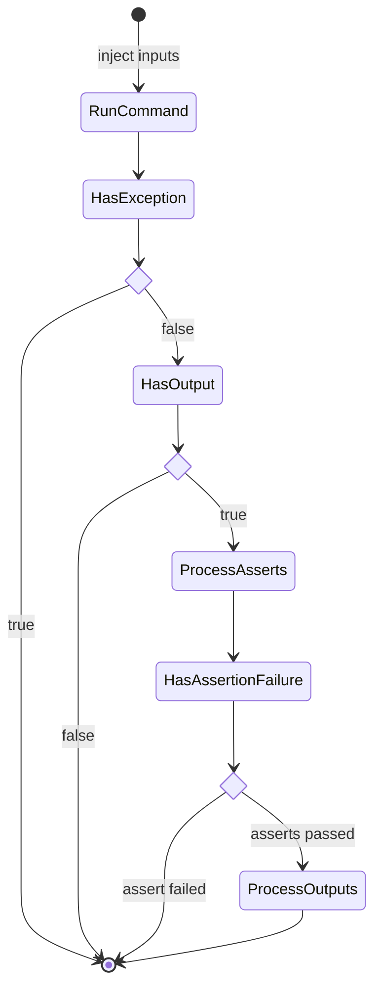

# MyWorkflows

[MyWorkflows](https://myworkflows.org) is a simple tool that helps you automate manual tasks.
It lets you encapsulate manual tasks as workflows, schedule them, and view their outputs.

The tool is written in Java and uses Vaadin as its UI framework.

MyWorkflows is ideal for small teams overwhelmed by daily manual tasks.
All workflows are defined in YAML, and the tool provides an intuitive UI for working with them.

## Technology stack

* Java 25 as the programming language.
* Spring Boot 4 as the application and DI framework.
* [Vaadin 25](https://vaadin.com) as the UI framework.
* [SQLite](https://www.sqlite.org/) as the relational database for persisting data.
* [Flyway](https://github.com/flyway/flyway) for database schema migrations.
* [JSON Schema Validator](https://github.com/networknt/json-schema-validator) for validating workflow scripts.
* [Groovy](https://groovy-lang.org/) as an additional language for defining commands.
* [Janino](https://www.janino.net/) as the Java runtime compiler.
* [SpEL](https://docs.spring.io/spring-framework/reference/core/expressions.html) as another runtime evaluator.

## Features

* **Modern, responsive UI** for a better user experience.
* **Authentication** and **authorization** enabled by default for secure access.
* **Vaadin Push** enabled: using WebSockets, the server can send real-time updates to the client.
* **Persistence layer** powered by **SQLite** for reliable data storage.
* A dedicated page for **workflow definition script development**, which lets you:
    * Write your script.
    * Inject parameters.
    * Run the script and view its output.
    * Use an editor with auto-completion to simplify writing workflow scripts.
    * Share the script together with its parameters.
* Replay of a failed workflow run, starting from the command that failed.
* Dedicated web pages for managing **workflow placeholders**, **workflow parameters**, **workflow definitions**,
  **workflow templates**, and **workflow runs**.
* A dedicated web page for managing **Java libraries** at runtime.
* A dedicated web page for writing **Markdown documentation**.
* A dedicated web page for viewing and analyzing **statistics**.
* A dedicated web page for editing application **settings**.

## How does it work?

### Terminology

* **Workflow**: A list of steps that together accomplish a given task.
* **Command**: A single step in the workflow. A command has a `name`, a `class`, `ifs`, `inputs`, `asserts`, and
  `outputs`. Only `name` and `class` are mandatory. Some commands (`loop` and `waitUntilSubPasses`) also require a list
  of `subcommands`.
* **If**: A condition that must be met for the command to run. If at least one condition is not met, the command is
  skipped.
* **Input**: A parameter that customizes the current step.
* **Assert**: After a command has run, if it produced an output, you can apply assertions to that output.
* **Output**: After a command has run, if it produced an output, you can process it further (for example, save it to
  another variable).
* **Variable**: A named value stored in the workflow run cache. Variables are produced by inputs and outputs and can be
  used by subsequent commands.

### Workflow

A `workflow` is the logical entity that groups the steps (called `commands`) needed to implement a task.
Each workflow has a `name`, so you can easily identify what it does.

A workflow can be run `manually` by the user or `automatically` by a scheduler.
Behind the scenes, a `thread pool` is responsible for executing workflows.
Each workflow runs on a single thread, and its commands are run sequentially.

A workflow definition can contain at most 100 `commands` and 10 `finallyCommands`.

#### Command

Each command has:

* a `name` - identifies the command
* a `class` - defines the type of the command
* `ifs` - conditions that must all be met for the command to run
* `inputs` - customize the current run
* an `output` - the value returned by the command
* `asserts` - check the output, if one is present
* `outputs` - process the output further and save partial results in other variables

Before anything else, all `ifs` are evaluated; if any of them is not `true`, the command is skipped.
Otherwise, the following state diagram describes how a command works:


```mermaid
stateDiagram-v2
    R : RunCommand
    A : ProcessAsserts
    O : ProcessOutputs
    HE : HasException
    HO: HasOutput
    HF : HasAssertionFailure
    state IE <<choice>>
    state IO <<choice>>
    state IF <<choice>>
    [*] --> R : inject inputs
    R --> HE
    HE --> IE
    IE --> [*] : true
    IE --> HO : false
    HO --> IO
    IO --> [*] : false
    IO --> A : true
    A --> HF
    HF --> IF
    IF --> [*] : assert failed
    IF --> O : asserts passed
    O --> [*]
```

#### Workflow Templates

Workflow templates let you schedule multiple workflow definitions to run automatically, based on a cron expression.
Besides the definitions, you can select a set of workflow parameters to be injected each time the template runs.

> [!TIP]
> You can assign a workflow parameter to a specific template by suffixing the parameter name with
> `.<workflowTemplateId>`. At runtime, when the parameter is injected into the workflow, the suffix is removed.

### Features

#### `Ace` editor

The tool uses [Ace](https://ace.c9.io/) as the code editor for workflow definition scripts.
The editor is available on the `Workflow Development` page.

The editor provides:
* **Syntax highlighting**
* **Live auto-completion**
* **Snippets**
  * type `input` to insert a snippet for an input expression with `name`, `class`, and `value`.
  * type `assert` to insert a snippet for an assert expression with `name`, `class`, and `value`.
  * type `output` to insert a snippet for an output expression with `name`, `class`, and `value`.
* **Key bindings**
  * <kbd>Alt</kbd> + <kbd>E</kbd> = Focus the editor.
  * <kbd>Ctrl</kbd> + <kbd>A</kbd> = Select all code. Requires editor focus.
  * <kbd>Ctrl</kbd> + <kbd>F</kbd> = Search the code. Requires editor focus.
  * <kbd>Ctrl</kbd> + <kbd>L</kbd> = Go to a specific line. Requires editor focus.
  * <kbd>Ctrl</kbd> + <kbd>Alt</kbd> + <kbd>F</kbd> = Reformat the code. Requires editor focus.
  * <kbd>Ctrl</kbd> + <kbd>Alt</kbd> + <kbd>W</kbd> = Toggle line wrapping. Requires editor focus.
  * <kbd>Ctrl</kbd> + <kbd>Alt</kbd> + <kbd>J</kbd> = Open the `java.script` or `groovy.script` under the cursor in the script editor. Requires editor focus.
* **Script editor for `java` and `groovy` commands**
  * click `Open in Java editor` / `Open in Groovy editor`, shown above each `java.script` / `groovy.script` input, to edit the script in a dedicated editor with Java / Groovy syntax highlighting.
  * press <kbd>Ctrl</kbd> + <kbd>S</kbd> or click `Save` to write the script back into the workflow definition. The script is re-indented automatically, the rest of the definition (including comments) stays untouched, and <kbd>Ctrl</kbd> + <kbd>Z</kbd> in the workflow editor undoes the whole change.
* **Search and replace with regular expressions**
* **Display of hidden characters**
* **Code folding**
* **Multiple cursors and selections**
* **Live syntax checking (for YAML)**
* **Cut, copy, and paste**
* and much more

#### `Finally` commands

`Finally commands` are special commands that are executed at the end of your workflow, regardless of whether the
workflow failed.
The concept is similar to the `try-finally` block in Java.

```
try { 
  // Run all commands in sequential order
} finally {
  // Run all finallyCommands in sequential order
}
```

> [!TIP]
> A single workflow definition cannot have more than 10 finally commands.

#### Placeholders

You can use global `placeholders` to avoid duplicating data across workflow definitions.
All placeholders are resolved immediately before a workflow runs.
Placeholders are persisted in a database table called `workflow_placeholders`.

Inside a workflow definition, a placeholder has the format `$$(PLACEHOLDER_NAME)`.
You can use placeholders inside any `input`, `assert`, and `output` (in both the `name` and `value` fields), including
those of subcommands.

> [!TIP]
> A placeholder name must match the pattern `[A-Z0-9_.]+` to be recognized as a valid placeholder.

> [!TIP]
> If a placeholder cannot be found, you will get a runtime exception.

#### Expressions

Expressions are the heart of this tool.
They let you pass information between commands.
Expressions are evaluated at runtime and can be used inside any `input`, `assert`, `output`, or `if`.
Inside these structures, the expression is always placed in the `value` field.
Each expression is evaluated by the runtime evaluator specified in the `class` field.

Currently, **3 runtime evaluators** are supported:

1. Set `class` to `groovy` to use the Groovy runtime evaluator.
2. Set `class` to `java` to use the Java runtime evaluator, based on the [Janino](https://www.janino.net/) runtime
   compiler.
3. Set `class` to `spel` to use
   the [SpEL](https://docs.spring.io/spring-framework/reference/core/expressions.html) runtime evaluator.

If `class` is not set, it defaults to `plain`, which means the value is used exactly as written.

The following variables are available inside an expression:

* `cache` - the workflow run cache (in SpEL, use `#cache`).
* `output` - the command output (in SpEL, use `#output`). Available only in `asserts` and `outputs`.

##### Examples

###### Check that the exit code of the `sshExec` command is 0, using the SpEL runtime evaluator

```yaml
name: Assert that output exitCode equals 0
class: spel
value: "#output.getExitCode() == 0"
```

###### Read a value from the workflow run cache and save it to another variable (named `sleep.time`)

```yaml
name: sleep.time
class: groovy
value: "cache.get('sleepTime').toInteger()"
```

##### Cache access patterns

As the examples above show, expressions can get long and hard to write.
In addition, accessing the workflow run cache with a call such as `cache.get('sleepTime')` makes the expression
harder to read.

This is why the tool provides a simpler alternative: **cache access patterns**.

Take one of the previous examples:

```yaml
name: sleep.time
class: groovy
value: "cache.get('sleepTime').toInteger()"
```

It can be rewritten like this:

```yaml
name: sleep.time
class: groovy
value: "$(sleepTime:Integer.class)"
```

The tool recognizes every string inside `value` that matches the following regular expression:
`\$\(([a-zA-Z0-9_.]+)(:[a-zA-Z0-9_.]+)?\)`.
The text between the parentheses has two parts: the first (mandatory) is the name of the variable to look up in the
workflow run cache, and the second (optional) is the expected type of its value.

The type must be written in the syntax of the evaluator you use:

* `groovy` and `java`: a class literal, for example `$(sleepTime:Integer.class)`.
* `spel`: a fully qualified class name, for example `$(sleepTime:java.lang.Integer)`.

If the workflow run cache has no variable named `sleepTime` of type `Integer`, you will get a runtime exception while
the workflow is running.

#### How to debug workflow runs?

To debug a workflow run, inject a parameter named `debug` of type `boolean` and set it to `true`.
With the debug flag enabled, the run also prints the resolved type and value of every command parameter.

#### Load Java libraries at runtime

The tool can load Java libraries (JAR files) at runtime, while the application is starting up.
This is useful if you want to extend `java` or `groovy` commands with more functionality.

To do this, use the following application config properties:

```yaml
my-workflows:
  config:
    library:
      base-directory: "./libs" # Directory where JAR files are discovered
      reload-after-upload: false # Set to true to reload libraries at runtime after uploading new ones
```

#### Comments

Technically, each workflow is defined in YAML.
If you are familiar with YAML, you probably know that comments are allowed:

```yaml
# This is a simple comment
name: sleep.time
class: groovy
value: "$(sleepTime:Integer.class)"
```

#### Anchors and aliases

Because workflows are written in YAML, you can use anchors and aliases to simplify a workflow definition.
You can find more details about how to use them
[here](https://www.educative.io/blog/advanced-yaml-syntax-cheatsheet#YAML-Anchors-and-Alias).

#### Shortcuts

Keyboard shortcuts are available in several views to make your work faster.

* **Workflow Development** view:
    * <kbd>Ctrl</kbd> + <kbd>Alt</kbd> + <kbd>R</kbd> = Run workflow
    * <kbd>Ctrl</kbd> + <kbd>Alt</kbd> + <kbd>U</kbd> = Update workflow definition
    * <kbd>Ctrl</kbd> + <kbd>Alt</kbd> + <kbd>S</kbd> = Share workflow

#### REST API

The app also provides a REST API that lets you interact with it programmatically.

The REST API is disabled by default. You can enable it by setting the application config property
`my-workflows.config.feature.restApiEnabled` to `true`.

Each user has a `token` field (usually 64 random characters), which is the API token used to authenticate REST API
calls. Tokens are unique, so no two users can have the same token.

To authenticate a REST API call, provide the `token` URL parameter with every request, for example:
`GET https://myworkflows.org/api/v1/workflow-definitions?token={TOKEN}`.

The following APIs are available:

##### `WorkflowDefinition` APIs

| Method | URI                                              | Description                                                                                                                                                                                                                                       |
|--------|--------------------------------------------------|---------------------------------------------------------------------------------------------------------------------------------------------------------------------------------------------------------------------------------------------------|
| `GET`  | `/api/v1/workflow-definitions`                   | Returns all workflow definitions as a list of `WorkflowDefinitionResponse` objects.                                                                                                                                                               |
| `GET`  | `/api/v1/workflow-definitions/{id}`              | Returns a single workflow definition (selected by `id`, of type `int`) as a `WorkflowDefinitionResponse` object. An exception is raised if nothing is found.                                                                                      |
| `POST` | `/api/v1/workflow-definitions/{id}/schedule-now` | Immediately schedules a run of a specific workflow definition (selected by `id`, of type `int`). The request body is mandatory and contains the parameters as a `Map<String, Object>`. Returns the UUID of the workflow run, as a string.          |

##### `WorkflowTemplate` APIs

| Method | URI                                            | Description                                                                                                                                              |
|--------|------------------------------------------------|----------------------------------------------------------------------------------------------------------------------------------------------------------|
| `GET`  | `/api/v1/workflow-templates`                   | Returns all workflow templates as a list of `WorkflowTemplateResponse` objects.                                                                          |
| `GET`  | `/api/v1/workflow-templates/{id}`              | Returns a single workflow template (selected by `id`, of type `int`) as a `WorkflowTemplateResponse` object. An exception is raised if nothing is found. |
| `POST` | `/api/v1/workflow-templates/{id}/schedule-now` | Immediately schedules a run of a specific workflow template (selected by `id`, of type `int`). Nothing is returned.                                      |

##### `WorkflowRun` APIs

| Method | URI                          | Description                                                                                                                                       |
|--------|------------------------------|---------------------------------------------------------------------------------------------------------------------------------------------------|
| `GET`  | `/api/v1/workflow-runs`      | Returns all workflow runs as a list of `WorkflowRunResponse` objects.                                                                             |
| `GET`  | `/api/v1/workflow-runs/{id}` | Returns a single workflow run (selected by `id`, of type `String`) as a `WorkflowRunResponse` object. An exception is raised if nothing is found. |

## Predefined command types

### Database command

Lets you interact with a relational database by running SQL queries.

| `class`    | Inputs                                                                                                                                                                                    | Output                                                                                                                   |
|------------|-------------------------------------------------------------------------------------------------------------------------------------------------------------------------------------------|--------------------------------------------------------------------------------------------------------------------------|
| `database` | <ul><li><strong>database.url</strong>: Mandatory. The JDBC connection URL.</li><li><strong>database.query</strong>: Mandatory. The query to execute. It must return a result set.</li></ul> | Returns `Optional<ResultSet>`. The result set is detached from the connection. The `Optional` is empty if no rows are returned. |

Example command:

```yaml
commands:
  - name: Run simple SELECT query
    class: database
    inputs:
      - name: database.url
        value: "jdbc:sqlite:database.db"
      - name: database.query
        value: "SELECT * FROM test"
```

### Mail command

Sends emails using the Jakarta Mail API.

| `class` | Inputs                                                                                                                                                                                                                                                                                                                                                                                                                                                                                                                                                                                                                                                                                                                                                                                                                                                                              | Output |
|---------|-------------------------------------------------------------------------------------------------------------------------------------------------------------------------------------------------------------------------------------------------------------------------------------------------------------------------------------------------------------------------------------------------------------------------------------------------------------------------------------------------------------------------------------------------------------------------------------------------------------------------------------------------------------------------------------------------------------------------------------------------------------------------------------------------------------------------------------------------------------------------------------|--------|
| `mail`  | <ul><li><strong>mail.from</strong>: Mandatory. The sender's email address.</li><li><strong>mail.to</strong>: Mandatory. The recipients' email addresses, separated by commas.</li><li><em>mail.cc</em>: Optional. CC email addresses, separated by commas.</li><li><em>mail.bcc</em>: Optional. BCC email addresses, separated by commas.</li><li><strong>mail.subject</strong>: Mandatory. The email subject.</li><li><strong>mail.body</strong>: Mandatory. The email body.</li><li><strong>mail.props</strong>: Mandatory. Jakarta Mail properties, as a map.</li><li><em>mail.bodyType</em>: Optional. The content type of the body. Default value: `text/html; charset=utf-8`.</li><li><em>mail.username</em>: Optional. The username used for authentication. Leave it blank to disable authentication.</li><li><em>mail.password</em>: Optional. The user's password.</li></ul> | N/A    |

Example command:

```yaml
commands:
  - name: Send a simple mail
    class: mail
    inputs:
      - name: mail.from
        value: "from@gmail.com"
      - name: mail.to
        value: "to@gmail.com"
      - name: mail.cc
        value: "cc@gmail.com"
      - name: mail.bcc
        value: "bcc@gmail.com"
      - name: mail.subject
        value: Just a simple subject
      - name: mail.body
        value: "Simple <strong>body</strong>"
      - name: mail.username
        value: user
      - name: mail.password
        value: pass
      - name: mail.props
        value:
          mail.smtp.auth: true
          mail.smtp.starttls.enable: true
          mail.smtp.host: sandbox.smtp.mailtrap.io
          mail.smtp.port: 25
          mail.smtp.ssl.trust: sandbox.smtp.mailtrap.io
```

### Groovy command

Runs Groovy code at runtime.
As you can imagine, this command is very powerful.

| `class`  | Inputs                                                                                                                                                                                                                                                                                                                                                            | Output                                         |
|----------|-------------------------------------------------------------------------------------------------------------------------------------------------------------------------------------------------------------------------------------------------------------------------------------------------------------------------------------------------------------------|------------------------------------------------|
| `groovy` | <ul><li><strong>groovy.script</strong>: Mandatory. The source code that defines the method named by `groovy.method`. The method is invoked with the workflow run cache as its only argument.</li><li><em>groovy.method</em>: Optional. The name of the method to invoke. Default value: `run`.</li></ul> | The return value of the invoked method, or none |

Example command:

```yaml
commands:
  - name: Run empty method
    class: groovy
    inputs:
      - name: groovy.script
        value: |
          def run(workflowRunCache) {
          }
      - name: groovy.method
        value: run
```

### HTTP Request command

Performs HTTP requests.

| `class`       | Inputs                                                                                                                                                                                                                                                                                                                                                                                                                                                                                                                 | Output                   |
|---------------|------------------------------------------------------------------------------------------------------------------------------------------------------------------------------------------------------------------------------------------------------------------------------------------------------------------------------------------------------------------------------------------------------------------------------------------------------------------------------------------------------------------------|--------------------------|
| `httpRequest` | <ul><li><strong>httpRequest.url</strong>: Mandatory. The request URL.</li><li><em>httpRequest.method</em>: Optional. The HTTP method. Default value: `GET`.</li><li><em>httpRequest.body</em>: Optional. The request body. No body is sent by default.</li><li><em>httpRequest.headers</em>: Optional. A map of request headers.</li><li><em>httpRequest.timeout</em>: Optional. The connection and read timeout, in milliseconds. Default value: `60000`.</li></ul> | `ResponseEntity<String>` |

Example command:

```yaml
commands:
  - name: Simple GET HTTP Request
    class: httpRequest
    inputs:
      - name: httpRequest.url
        value: https://google.com
```

### Java command

Runs Java code at runtime.
Like the Groovy command, this command is very powerful.

| `class` | Inputs                                                                                                                                                                                                                                                                                                                                                                                                                                                                                                                                                                                                                                                                                                                                                                                                         | Output                                          |
|---------|----------------------------------------------------------------------------------------------------------------------------------------------------------------------------------------------------------------------------------------------------------------------------------------------------------------------------------------------------------------------------------------------------------------------------------------------------------------------------------------------------------------------------------------------------------------------------------------------------------------------------------------------------------------------------------------------------------------------------------------------------------------------------------------------------------------|-------------------------------------------------|
| `java`  | <ul><li><strong>java.script</strong>: Mandatory. The source code of the class named by `java.clazz`, which must have a public no-args constructor and a public method named by `java.method` that takes a `WorkflowRunCache` argument.</li><li><em>java.method</em>: Optional. The name of the method to invoke. Default value: `run`.</li><li><em>java.clazz</em>: Optional. The name of the class to instantiate. Default value: `DynamicClass`.</li><li><em>java.sourceVersion</em>: Optional. The Java source version used to compile the script. Default value: `11`.</li><li><em>java.targetVersion</em>: Optional. The Java target version used to compile the script. Default value: `11`.</li></ul> | The return value of the invoked method, or none |

Example command:

```yaml
commands:
  - name: Run method which returns 0
    class: java
    inputs:
      - name: java.script
        value: |
          import org.myworkflows.domain.WorkflowRunCache;
          public class DynamicClass {
            public int run(WorkflowRunCache cache) {
              return 0;
            }
          }
      - name: java.method
        value: run
      - name: java.clazz
        value: DynamicClass
```

### Loop command

Iterates over a list of items and runs the list of `subcommands` for each of them.
You can think of it as the equivalent of a `for` loop in Java.

| `class` | Inputs                                                                                                                                                                                                             | Output                                   |
|---------|--------------------------------------------------------------------------------------------------------------------------------------------------------------------------------------------------------------------|------------------------------------------|
| `loop`  | <ul><li><strong>loop.items</strong>: Mandatory. The list of items.</li><li><em>loop.backoffPeriod</em>: Optional. The pause, in milliseconds, between two iterations. Default value: `1000`.</li></ul> | Returns the number of items. Type: `int` |

During each iteration, the current item is available in the `loop.item` variable.
Outputs of subcommands are not saved directly: each output variable becomes a map whose keys are the loop items and
whose values are the results of the corresponding iterations.

Example command:

```yaml
commands:
  - name: Upper-case every item
    class: loop
    inputs:
      - name: loop.items
        value:
          - first
          - second
      - name: loop.backoffPeriod
        value: 0
    subcommands:
      - name: Upper-case current item
        class: groovy
        inputs:
          - name: groovy.script
            value: |
              def run(cache) {
                cache.get('loop.item').toUpperCase()
              }
        outputs:
          - name: upperCaseItems # becomes {first: FIRST, second: SECOND}
            class: spel
            value: "#output"
```

### Wait until subcommands pass command

Runs the list of `subcommands` repeatedly until all of them pass (no exception and no failed assertion) or until the
maximum number of rounds is reached.
This is useful for waiting until a resource becomes available.

| `class`              | Inputs                                                                                                                                                                                                                                                             | Output                                                                                  |
|----------------------|--------------------------------------------------------------------------------------------------------------------------------------------------------------------------------------------------------------------------------------------------------------------|-----------------------------------------------------------------------------------------|
| `waitUntilSubPasses` | <ul><li><em>waitUntilSubPasses.rounds</em>: Optional. The maximum number of rounds. Default value: `3`.</li><li><em>waitUntilSubPasses.backoffPeriod</em>: Optional. The pause, in milliseconds, between two rounds. Default value: `1000`.</li></ul> | Returns the number of unused rounds, or `-1` if every round failed. Type: `int` |

> [!IMPORTANT]
> The command does not fail when every round fails. Add an assert (for example, `#output >= 0`) if the workflow should
> fail in that case.

Example command:

```yaml
commands:
  - name: Wait until the service is up
    class: waitUntilSubPasses
    inputs:
      - name: waitUntilSubPasses.rounds
        value: 5
      - name: waitUntilSubPasses.backoffPeriod
        value: 2000
    subcommands:
      - name: Call the health endpoint
        class: httpRequest
        inputs:
          - name: httpRequest.url
            value: http://my-service:8080/health
    asserts:
      - name: The service is up
        class: spel
        value: "#output >= 0"
```

### Nothing command

This command does nothing.
Its purpose is to inject inputs into the workflow pipeline.

| `class`   | Inputs | Output |
|-----------|--------|--------|
| `nothing` | N/A    | N/A    |

Example command:

```yaml
commands:
  - name: Inject input parameters or process existing ones
    class: nothing
    inputs:
      - name: test
        value: Just a simple test
```

### Print command

Captures variables during workflow execution and displays their values in the UI.

| `class` | Inputs                                                                                                          | Output                                                                                             |
|---------|-----------------------------------------------------------------------------------------------------------------|----------------------------------------------------------------------------------------------------|
| `print` | <ul><li><strong>print.keys</strong>: Mandatory. The list of names of the variables to display.</li></ul>        | Returns the number of keys that were found in the workflow run cache and marked for printing. Type: `int`. |

Example command:

```yaml
commands:
  - name: Inject input parameters or process existing ones
    class: nothing
    inputs:
      - name: test
        value: Just a simple test
  - name: Print 'test' input
    class: print
    inputs:
      - name: print.keys
        value:
          - test
```

> [!IMPORTANT]  
> For every variable whose name contains `password` (case-insensitive), each non-whitespace character of its value is
> replaced with `*`.

### Sleep command

Pauses the current workflow execution for a given amount of time.
The time unit is milliseconds.

| `class` | Inputs                                                                                               | Output                                       |
|---------|------------------------------------------------------------------------------------------------------|----------------------------------------------|
| `sleep` | <ul><li><strong>sleep.time</strong>: Mandatory. The number of milliseconds to sleep.</li></ul> | Returns the actual time slept. Type: `long`. |

Example command:

```yaml
commands:
  - name: Sleep for 1 second
    class: sleep
    inputs:
      - name: sleep.time
        value: 1000
```

### Single SSH command

Executes a single command in an SSH session.

Equivalent SSH command: `ssh user@localhost ls -l`

| `class`   | Inputs                                                                                                                                                                                                                                                                                                                                                                                                                                                                                                     | Output                                                                          |
|-----------|------------------------------------------------------------------------------------------------------------------------------------------------------------------------------------------------------------------------------------------------------------------------------------------------------------------------------------------------------------------------------------------------------------------------------------------------------------------------------------------------------------|---------------------------------------------------------------------------------|
| `sshExec` | <ul><li><strong>sshExec.host</strong>: Mandatory. The host.</li><li><strong>sshExec.command</strong>: Mandatory. The command to execute.</li><li><strong>sshExec.username</strong>: Mandatory. The username.</li><li><strong>sshExec.password</strong>: Mandatory. The password.</li><li><em>sshExec.port</em>: Optional. The SSH port. Default value: `22`.</li><li><em>sshExec.timeout</em>: Optional. The timeout, in milliseconds, for the operation to complete. Default value: `60000`.</li></ul> | `SshCommandOutput` - contains `exitCode` as an integer and `output` as a string |

Example command:

```yaml
commands:
  - name: Run 'ls -l' command
    class: sshExec
    inputs:
      - name: sshExec.host
        value: localhost
      - name: sshExec.command
        value: ls -l
      - name: sshExec.username
        value: user
      - name: sshExec.password
        value: pass
    asserts:
      - name: Command is successful
        class: spel
        value: "#output.getExitCode() == 0"
```

### Multiple SSH commands

Executes multiple commands in a single SSH session.
The command opens a shell and runs all the given commands in it.

| `class`    | Inputs                                                                                                                                                                                                                                                                                                                                                                                                                                                                                                                   | Output                                                                                                                                  |
|------------|--------------------------------------------------------------------------------------------------------------------------------------------------------------------------------------------------------------------------------------------------------------------------------------------------------------------------------------------------------------------------------------------------------------------------------------------------------------------------------------------------------------------------|-----------------------------------------------------------------------------------------------------------------------------------------|
| `sshShell` | <ul><li><strong>sshShell.host</strong>: Mandatory. The host.</li><li><strong>sshShell.commands</strong>: Mandatory. The list of commands to execute.</li><li><strong>sshShell.username</strong>: Mandatory. The username.</li><li><strong>sshShell.password</strong>: Mandatory. The password.</li><li><em>sshShell.port</em>: Optional. The SSH port. Default value: `22`.</li><li><em>sshShell.timeout</em>: Optional. The timeout, in milliseconds, for the operation to complete. Default value: `60000`.</li></ul> | `SshCommandOutput` - contains `exitCode` (the exit code of the last command) as an integer and `output` (the combined output of all commands) as a string |

Example command:

```yaml
commands:
  - name: Run multiple SSH commands
    class: sshShell
    inputs:
      - name: sshShell.host
        value: localhost
      - name: sshShell.commands
        value:
          - ls -l
          - df -h
      - name: sshShell.username
        value: user
      - name: sshShell.password
        value: pass
    asserts:
      - name: Command is successful
        class: spel
        value: "#output.getExitCode() == 0"
```

## Examples of workflow pipelines

You can find a set of concrete workflow pipelines to use as
inspiration [here](https://github.com/msurdeanu/my-workflows-app/wiki/Samples-of-workflow-definitions).

## From a development perspective

Would you like to contribute to this project as a developer? You can find more technical
details [here](https://github.com/msurdeanu/my-workflows-app/wiki/From-development-perspective).
